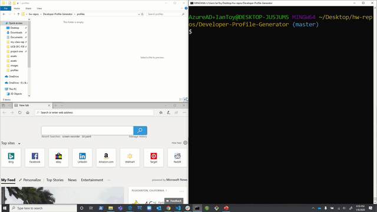

# Developer-Profile-Generator
A node.js application that generates pdf's of users' github profile information and color preference.

## Description
This is an application that takes two user inputs, their GitHub username and a chosen color, and produces a PDF of their basic profile information.

## Tools Used
* HTML
* CSS
* JavaScript
* Bootstrap
* Inquirer
* Axios
* Electron
* GitHub API

## Under the Hood
Below are a few sections of code that are essential to the functionality of the application.

We make use of several npm packages, namely Inquirer and Axios to take in user input and make an API query.

First, we initiate an inquirer prompt:

    inquirer.prompt([
    {
        type: "input",
        name: "username",
        message: "What is your GitHub username?"
    },
    {
        type: "checkbox",
        message: "What is your favorite color?",
        name: "color",
        choices: [
        "green", 
        "blue", 
        "pink", 
        "red"
        ]
    },
    ])
    
This records our users GitHub username and their "favorite color" (it's limited to four choices, so die-hard fans of shartruce and indigo will have to make do).

We then use this information to inform our query:

    .then(function(response) {
    username = response.username;
    usercolor = colors[response.color];

    const queryURL = "https://api.github.com/users/" + username;
    axios.get(queryURL).then(function(response) 

Once we have received this information we store the response in a new object for future use.    

    {
        gitInfo = response;
        var userObj = {
        gitInfo: gitInfo,
        usercolor: usercolor
        };
        console.log(gitInfo.data)
        return userObj;   
    })

Saving the response from the query as well as the information in our colors object (not listed here) in a single object makes the use of template literals in constructing our document much easier. Which brings us to our next example!

    

        <!-- FIRST ROW -->
        

        

            <h4>${gitInfo.data.bio}</h2>
        

        

        <!-- SECOND ROW -->
        

        

            

            <h3>Public Repositories</h3>
            <h4>${gitInfo.data.public_repos}</h4>
            

        

        

            

            <h3>Followers</h3>
            <h4>${gitInfo.data.followers}</h4>
            

        

    

This is just a few of our uses of template literals, but throughout the page we are able to easily write data to our new document and style it per the user's preference using this method.

## The App in Action!

## Authors
Ian Toy

## Acknowledgements
Special thanks to our instructor Jerome and especially to our TA Mahisha, who grately helped solidify my understanding of how information is stored and passed between objects and functions. Thanks a bunch!